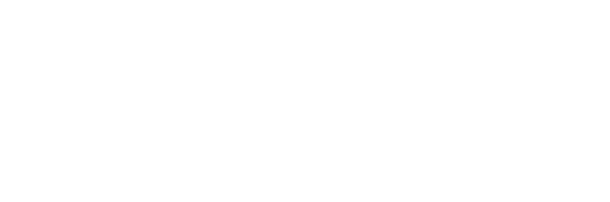

<div align="center">
  <a href="https://github.com/fentaris-io/fentaris">
    <picture>
      
    </picture>
  </a>
</div>

> ⚠️ **Disclaimer / Avviso:** We are renaming the project from **Panther** to **Fentaris**. During this transition, there may be temporary issues or inconsistencies.  
> Stiamo rinominando il progetto da **Panther** a **Fentaris**; durante questa fase potrebbero esserci problemi temporanei o incongruenze.

&nbsp; 

<p align="center">
  <a href="./docs/index.mdx" alt="Documentation">
    </a>
  <a href="./packages/core" alt="Core package">
    </a>
  <a href="./packages/cli" alt="CLI package">
    </a>
  <a href="./packages/approval-telegram" alt="Telegram approval package">
    </a>
  <br/>
  <a href="./package.json" alt="TypeScript">
    </a>
  <a href="./pnpm-workspace.yaml" alt="pnpm workspace">
    </a>
  <a href="./packages/core/package.json" alt="License">
    </a>
</p>

## About

<b>Fentaris</b> is a centralized MCP proxy for routing multiple MCP servers through one controlled endpoint.

- **Unify** stdio, Streamable HTTP, SSE, and HTTP upstream MCP servers behind one proxy.
- **Protect** tool calls, resources, prompts, and completions with policy, identity, middleware, hooks, and rate limits.
- **Observe** every proxied operation with structured logging, lifecycle events, and per-request context.
- **Ship** generated proxy projects with the Fentaris CLI and local encrypted auth files.

Fentaris is designed for teams that want MCP servers to behave like production infrastructure: stable names, centralized governance, auditable calls, and predictable client-facing endpoints.

## Documentation

Start with the [docs homepage](./docs/index.mdx), or jump directly to:

- [Quickstart](./docs/getting-started/quickstart.mdx): create and run a Fentaris proxy project.
- [Architecture](./docs/core/architecture.mdx): understand the runtime model.
- [Proxy setup](./docs/guides/proxy-setup.mdx): production-ready configuration patterns.
- [Governance auth](./docs/guides/governance-auth.mdx): users, groups, policy, API keys, and upstream credentials.
- [API reference](./docs/reference-auto/index.mdx): generated package reference.

## Express-like SDK

Install the core package in an existing project:

```bash
pnpm add @fentaris/core
```

Build a proxy in a few lines:

```ts
import { fentaris, server, stdio } from "@fentaris/core";

const proxy = fentaris({
  port: 3000,
  path: "/mcp",
  servers: [
    server("filesystem", {
      transport: stdio({
        command: "npx",
        args: ["-y", "@modelcontextprotocol/server-filesystem", "/tmp"],
      }),
    }),
  ],
});

await proxy.start();
// MCP endpoint: http://localhost:3000/mcp
```

Upstream tool names are still stable and namespaced by server. A filesystem tool is exposed to clients with a proxy name such as:

```txt
filesystem__list_directory
```

Add another upstream without changing the client endpoint:

```ts
import { fentaris, server, streamableHttp } from "@fentaris/core";

const proxy = fentaris({
  servers: [
    server("docs", {
      transport: streamableHttp({
        url: "https://mcp.specification.website/mcp",
      }),
    }),
  ],
});
```

## Governance

Add users, groups, and policy:

```ts
import { group, fentaris, policy, user } from "@fentaris/core";

const readOnly = policy("read-only")
  .server("filesystem")
  .allow("list_directory");

const proxy = fentaris({
  servers: [filesystem],
  groups: [
    group({
      id: "operators",
      users: [user("alice", { email: "alice@example.com" })],
      policy: readOnly,
    }),
  ],
});
```

Block a sensitive tool:

```ts
proxy.server("filesystem").tool("write_file", (ctx, next) => {
  return ctx.subject?.hasGroup("admins")
    ? next()
    : ctx.deny("Admin required.");
});
```

Ask for approval before dangerous tools:

```ts
import { approval, policy } from "@fentaris/core";

const deploy = policy("deploy")
  .server("github")
  .allow("deploy_production", approval.manual({
    reason: "Production deploy requires approval",
  }));
```

Hide tools from clients:

```ts
proxy.on("tools:list:after", ({ tools }) => {
  return tools?.filter((tool) => !tool.name.includes("__dangerous"));
});
```

Modify a tool result:

```ts
proxy.server("github").tool("search_issues", async (_ctx, next) => {
  const result = await next();
  if ("content" in result) {
    result.content.push({ type: "text", text: "Filtered by Fentaris" });
  }
  return result;
});
```

Observe every tool call:

```ts
proxy.on("tool:success", ({ ctx, durationMs }) => {
  ctx.log.info("tool.success", { tool: ctx.tool?.name, durationMs });
});
```

Policies can govern tool calls and MCP capabilities such as resources, prompts, and completion. Runtime routes can deny, approve, hide, log, or transform calls.

## CLI

Create the same kind of proxy from one command:

```bash
pnpm dlx @fentaris/cli init my-proxy
```

The generated project includes a runnable proxy, demo API keys, local encrypted auth files, policy rules, rate limiting, one stdio upstream, one remote HTTP MCP upstream, TypeScript config, package scripts, and project checks.

Connect your MCP client to the generated endpoint, usually `http://localhost:4000/mcp`, and send the generated API key in the default Fentaris auth header:

```txt
x-fentaris-api-key: <guest-or-admin-api-key>
```

## Local Auth

Fentaris can resolve caller identity and upstream credentials from local encrypted files:

```bash
fentaris auth init --dir .fentaris --key "$FENTARIS_AUTH_KEY"
fentaris auth set-api-key --dir .fentaris --key "$FENTARIS_AUTH_KEY" --user alice --api-key "$ALICE_API_KEY"
fentaris auth set-credential --dir .fentaris --key "$FENTARIS_AUTH_KEY" --user alice --ref github.token --value "$GITHUB_TOKEN"
```

Or, inside a generated Fentaris project:

```bash
fentaris secrets set github.token --user alice
```

Credential values are not exposed to middleware, hooks, logs, or policy callbacks.

## Packages

| Package | Description |
| --- | --- |
| [`@fentaris/core`](./packages/core) | Proxy runtime, MCP server wrapper, transports, policy, auth, logging, and middleware APIs. |
| [`@fentaris/cli`](./packages/cli) | Project generator and local development commands. |
| [`@fentaris/approval-telegram`](./packages/approval-telegram) | Telegram approval adapter for Fentaris policies. |

## Development

Install dependencies:

```bash
pnpm install
```

Build all packages:

```bash
pnpm build
```

Run checks:

```bash
pnpm lint
pnpm typecheck
pnpm --filter @fentaris/core test
pnpm --filter @fentaris/cli test
pnpm --filter @fentaris/approval-telegram test
```

Generate docs reference:

```bash
pnpm docs:generate
```

## License

MIT, as declared by the published Fentaris packages.
