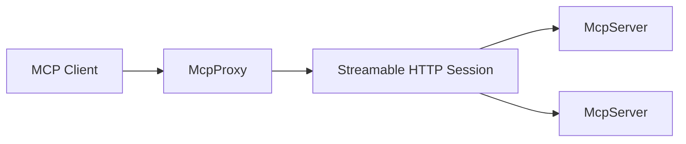

Fentaris is composed of three building blocks that keep the proxy predictable and easy to extend.

## Request flow

1. An MCP client connects to `McpProxy`.
2. Fentaris initializes an MCP session over HTTP.
3. The proxy lists tools from each `McpServer` and applies naming rules.
4. Tool calls are dispatched through middleware and hooks before forwarding.

## Components

**McpProxy**
- Owns HTTP lifecycle, sessions, and orchestration.
- Normalizes tool names to prevent collisions.

**McpServer**
- Adapts an MCP transport to Fentaris.
- Supports user-based environment injection.

**FentarisTransport**
- Transport abstraction used by `McpServer`.
- Current implementation: `StdioTransport` for local MCP processes.

## Sessions

Fentaris uses streamable HTTP sessions. Each session tracks its own MCP server instance and is closed when the client disconnects.

## Error handling

Errors from middleware or upstream servers are normalized and returned as JSON-RPC errors. Middleware can also inject structured tool errors via `ResponseController`.
