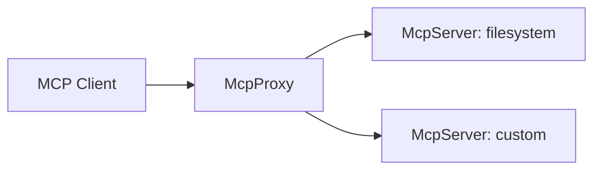

Fentaris is a centralized MCP proxy. It sits in front of your MCP servers and exposes a single HTTP endpoint with policy, routing, and observability built in.

## When to use Fentaris

- You run multiple MCP servers and want a single entrypoint.
- You need per-user policy or auditing without changing existing servers.
- You want structured logs and consistent naming across tools.

## Core concepts

**McpProxy**
- Exposes an HTTP endpoint (default `/mcp`).
- Aggregates tools from multiple servers and forwards tool calls.

**McpServer**
- A thin wrapper around an MCP transport.
- Supports per-user environment injection via `env`.

**FentarisTransport**
- Interface that adapts a transport to list tools, call tools, and close.
- `StdioTransport` is the easiest way to connect local MCP servers.

**Middleware and hooks**
- `proxy.use(...)` for policy, logging, and access control.
- `proxy.on("call", ...)` to intercept tool calls with filters.

## Architecture

## Tool naming

Fentaris prefixes tool names to avoid collisions. Each tool becomes `server__tool`, and the displayed title includes the server `displayName`.

## What you will do next

1. Configure one or more `McpServer` instances with transports.
2. Instantiate `McpProxy` and attach middleware or hooks.
3. Start the HTTP endpoint and connect your MCP client.

If you want to build a working setup now, jump to the quickstart.

<Card title="Quickstart" icon="rocket" href="/getting-started/quickstart" horizontal>
  Build a proxy in minutes with a minimal setup.
</Card>
