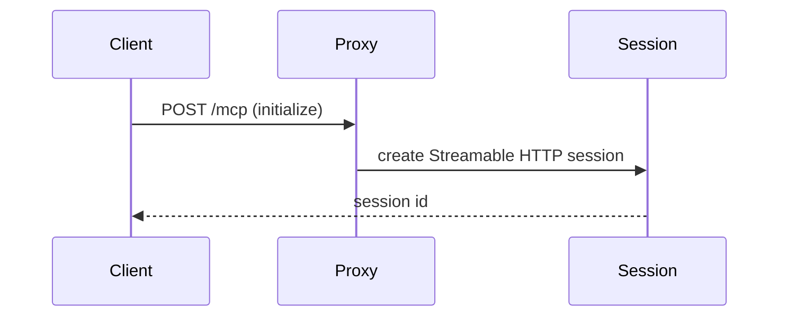
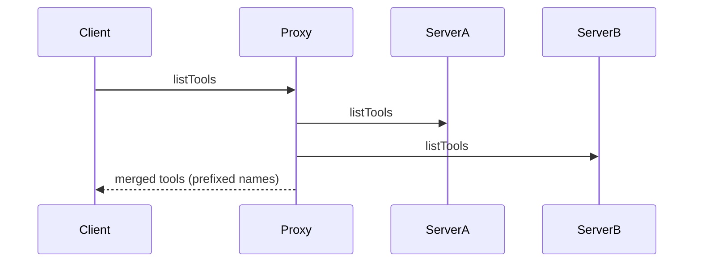
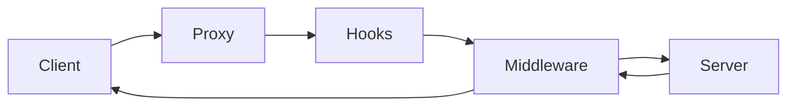

Use these diagrams to understand how requests move through Panther. Each diagram maps to an operational moment: initialization, discovery, and tool calls. This is helpful when you want to explain the system to a new team member or debug a request path.

If you are building a custom transport or middleware chain, keep this page open as a reference.

## Initialization flow

During initialization the proxy creates a session and attaches the MCP SDK server transport. This is the point where `name` and `version` are announced to the client.

## Tool discovery flow

Tool discovery is where `onListTools` filters run. Use this to hide internal tools or to expose only the subset allowed for the current user.

## Tool call flow with middleware

Hooks run first and can short-circuit a call. Middleware runs next and can enforce policy, inject guidance, and augment logs. The server is only invoked when middleware allows it.

## Where to go next

- For policy and access control, see [Middleware](/guides/middleware).
- For targeted audits, see [Hooks](/guides/hooks).
- For transport details, see [Transports](/core/transports).
